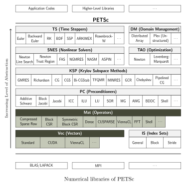

# Autotuning of [PETSc](https://www.mcs.anl.gov/petsc/index.html) in Hybrid HPC Environments

System of equations in matrix form are the basic formulation for building applications to solve *partial differential equations* (PDE) problems. In particular, computational algorithms based on the finite differences method (FDM) or the finite element method (FEM) are the most used in engineering and scientific research [1]. Due to the large size and complexity of the matrices that arise from real-world applications of such methods, *high performance computing* (HPC) strategies are required to attain satisfactory execution times.

The development of HPC applications to compute numerical solutions for PDEs is a complex task, but software packages like **PETSc** provide reliable toolkits to streamline the development process. [PETSc](https://www.mcs.anl.gov/petsc/index.html) is a suite of data structures and routines [2] for the scalable (parallel) solution of scientific applications modeled by partial differential equations. It supports MPI, and GPUs through CUDA or OpenCL, as well as hybrid MPI-GPU parallelism.

## PETSc

PETSc is built using the **MPI** (*Message Passing Interface*) standard, so almost all of its solving methods support the three main models for numerical HPC programming:

Distributed memory / cluster architecture
:   The computation task is divided in processes running in separate machines, which communicate with each other through a high-speed network link.

Shared memory / symmetric multiprocessing
:   The local machine has one or more identical CPUs able to run multiple processes or threads in parallel. The main memory is shared among the local CPUs.

General-purpose GPU programming
:   Specialized threads execute on a physically separate device that operates as a co-processor to the host running the program. Originally, PETSc supported only distributed and SMP architectures, but current versions also support GPU programming [5].

The abstraction layer provided by PETSc allows the writing of highly efficient generic parallel code which is portable to any of these three categories. The PETSc toolkit is organized as follows:

The highlighted items (**Mat** and **Vet**) are the primitive data structures which will differ depending on the architecture in use, whereas the higher abstraction layers do not change from the programmer's perspective.

*Mat* is the abstract PETSc matrix object used to manage all linear operators in PETSc. Examples of Mat types are:

- **seqaij**: A matrix type to be used for sequential sparse matrices, based on compressed sparse row format.
- **mpiaij**: A matrix type to be used for parallel sparse matrices.
- **seqbaij**: A matrix type to be used for sequential block sparse matrices, based on block sparse compressed row format.
- **mpibaij**: A matrix type to be used for distributed block sparse matrices.
- **aijcusparse**: A matrix type to be used for sparse matrices whose data resides on NVIDIA GPUs.

*Vec* defines the vector component of PETSc. Examples of Vec types are:

- **seq**: The basic sequential vector.
- **mpi**: The basic parallel vector.
- **seqcuda**: The basic sequential vector, modified to use CUDA.
- **mpicuda**: The basic parallel vector, modified to use CUDA.
- **nest**: Vector type consisting of nested subvectors, each stored separately.

There are other Mat and Vec types, as well as options that affect how PETSc processes these objects, such as the _solver type_. A solver may perform well when running on CPU, but may not perform as well when running on GPU.

## Search Space for Performance Improvement

The programming model used by PETSc gives the opportunity to fine tune how the numerical solution will be obtained. It is even possible to combine CPU and GPU based strategies, depending on the characteristics of the problem and how the data structures are arranged in memory. However, it is not easy to predict how the different configurations impact the processing time and the amount of memory copy operations on such complex systems.

### PETSc Parameters

PETSc provides a simple mechanism to customize its data structures and methods at runtime, called *options database*. All runtime options correspond to particular PETSc routines that can be explicitly called from within a program to set compile-time defaults. For many applications it is natural to use a combination of compile-time and runtime choices. For example, when solving a linear system, one could explicitly specify use of the Krylov subspace technique _BiCGStab_ by calling _KSPSetType(ksp,KSPBCGS)_. One could then override this choice at runtime with the option `-ksp_type tfqmr` to select the Transpose-Free QMR algorithm.

For the purpose of tuning the execution of a PDE problem, the following PETSc componnents are relevant:

- **Vec**: Provides the vector operations required for setting up and solving large-scale linear and nonlinear problems. Includes easy-to-use parallel scatter and gather operations, as well as special-purpose code for handling ghost points for regular data structures.

- **Mat**: A large suite of data structures and code for the manipulation of parallel sparse matrices. Includes four different parallel matrix data structures, each appropriate for a different class of problems.

- **PC**: A collection of sequential and parallel preconditioners, including (sequential) ILU(k), LU, and (both sequential and parallel) block Jacobi, overlapping additive Schwarz methods and structured MG.

- **KSP**: Parallel implementations of many popular Krylov subspace iterative methods, including GMRES, CG, CGS, Bi-CG-Stab, two variants of TFQMR, CR, and LSQR. All are coded so that they are immediately usable with any preconditioners and any matrix data structures, including matrix-free methods.

Most of the component choices are interchangeable between architectures. For example, the _mpi_ vector type corresponds to the basic parallel vector for CPU parallel processes, whilst _mpicuda_ is the basic parallel vector for _CUDA_ processes. The PC and KSP components are higher level abstractions, so they are able to work with any of the underlying Vec and Mat objects. However, a particular choice for these components can be better suited for one architecture over the other.

### Architecture Parameter

PETSc relies on MPI to setup how many processes will be launched in parallel, given it much versatility on how the program will run. It is possible, for example, to test the same program in alternative scenarios:

- CPU only parallel execution.
- GPU only parallel execution.
- CPU and GPU parallel execution.

The combination of CPU and GPU may not improve the execution time, as the combination of both may result in an increase of memory copy operations between devices. Another important factor affecting the amount of copy operations is the size or the resolution of the problem, which may result in a non-linear cost/benefit balance between CPU and GPU as the number of elements in the matrix increase.

### Resolution Parameter

All the numerical methods to solve PDEs perform a discretization of the problem's domain into a mesh of points. The greater the resolution of the mesh, the better will be the approximate solution. Therefore, the same problem can be dynamically configured to provide better approximations, at the expense of increasing the memory and processing usage.

A higher resolution of the mesh, although not affecting the formulation of the problem, can affect the performance on each architecture differently. For example, PETSc can allocate the sparse matrices that arise from PDEs directly in the GPU, so the increase in the mesh resolution not necessarily result in more memory copy operations. Indeed, a lower resolution mesh may perform better on CPU, whereas the same problem with a higher resolution mesh may perform better on GPU.

### Other Parameters

- Compilation parameters?
- Source-to-source transformation?

## Performance Evaluation

## Preliminary References

[1] Freund, Roland W, Gene H Golub, and Noël M Nachtigal. 1992. “Iterative Solution of Linear Systems.” Acta Numerica 1. Cambridge University Press: 57–100.

[2] Balay, Satish, Shrirang Abhyankar, Mark F. Adams, Jed Brown, Peter Brune, Kris Buschelman, Lisandro Dalcin, et al. 2020. “PETSc Users Manual.” ANL-95/11 - Revision 3.13. Argonne National Laboratory. https://www.mcs.anl.gov/petsc.

[3] Kumbhar, Pramod. 2011. “Performance of Petsc Gpu Implementation with Sparse Matrix Storage Schemes.” PhD thesis, Master’s thesis, The University of Edinburgh (Aug 2011).

[4] Mametjanov, Azamat, Daniel Lowell, Ching-Chen Ma, and Boyana Norris. 2012. “Autotuning Stencil-Based Computations on Gpus.” In 2012 Ieee International Conference on Cluster Computing, 266–74. IEEE.

[5] Minden, Victor, Barry Smith, and Matthew G Knepley. 2013. “Preliminary Implementation of Petsc Using Gpus.” In GPU Solutions to Multi-Scale Problems in Science and Engineering, 131–40. Springer.

