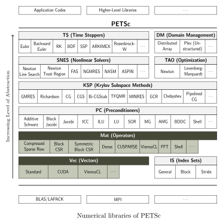

# Autotuning of PETSc in Hybrid HPC Environments

System  of equations  in  matrix form  are the  basic  formulation for  building
applications  to  solve *Partial  Differential  Equations*  (PDE) problems.   In
particular,  computational algorithms  based  on the  Finite Differences  Method
(FDM) or the  Finite Element Method (FEM)  are the most used  in engineering and
scientific research  [1]. Due to the  large size and complexity  of the matrices
that  arise from  real-world  applications of  such  methods, *High  Performance
Computing* (HPC) is required to attain satisfactory execution times.

The development of HPC applications to compute numerical solutions for PDEs is a
complex task, but software packages  such as **PETSc** provide reliable toolkits
to streamline development.  [PETSc](https://www.mcs.anl.gov/petsc/index.html) is
a  library [2]  for scalable  and parallel  solution of  scientific applications
modeled by partial differential equations.   PETSc supports MPI and GPUs through
CUDA or OpenCL, as well as heterogeneous MPI-GPU parallelism.

## PETSc

PETSc is built using the *Message Passing Interface* standard (MPI), and most of
its PDE solvers support the three main models for numerical HPC programming:

- Distributed memory  and cluster architecture: The computation  task is divided
in processes  running in  separate machines, which  communicate with  each other
through a high-speed network link.

- Shared memory and symmetric multiprocessing: The local machine has one or more
identical CPUs able  to run multiple processes or threads  in parallel. The main
memory is shared among the local CPUs.

- General-purpose GPU  programming: Specialized threads execute  on a physically
separate  device  that operates  as  a  co-processor  to  the host  running  the
program. Originally, PETSc supported only distributed and SMP architectures, but
current versions also support GPU programming [5].

The abstraction layer provided by PETSc enables writing highly efficient generic
parallel code  which is  portable to  any of these  three categories.  The PETSc
toolkit is organized as follows:

The highlighted  items (**Mat** and  **Vet**) are the primitive  data structures
which  will differ  depending on  the architecture  in use,  whereas the  higher
abstraction layers do not change from the programmer's perspective.

For instance,  if the **aijcusparse** matrix type is chosen,  then PETSc solvers
will automatically select the proper  data structure and related instructions to
compute sparse matrix operations in NVIDIA's GPUs using CUDA. Therefore, the
programmer does not need to pick in advance where and how the parallel computation
will be performed.

## Search Space for Performance Improvement

The programming model used  by PETSc gives the opportunity to  fine tune how the
numerical solution will be obtained. We can choose between CPU and GPU-based
strategies, depending  on the characteristics  of the  problem and how  the data
structures should be arranged in memory. However, it is not easy to  predict how
the different configurations impact the processing time and the amount of memory
copy operations on such complex systems.

### PETSc Parameters

PETSc provides a  simple mechanism to customize its data  structures and methods
at  runtime,  called  *options  database*. All  runtime  options  correspond  to
particular PETSc routines that can be explicitly called from within a program to
set  compile-time  defaults. For  many  applications  it  is  natural to  use  a
combination of  compile-time and  runtime choices. For  example, when  solving a
linear system, one could explicitly specify use of the Krylov subspace technique
_BiCGStab_ by  calling _KSPSetType(ksp,KSPBCGS)_.  One could then  override this
choice at runtime with the option `-ksp_type tfqmr` to select the Transpose-Free
QMR algorithm.

The list of parameters of interest for the purpose of
tuning the execution of a PDE problem are listed in the file
[Parameters.md](../Parameters.md).

## Mesh Resolution

All the numerical  methods to solve PDEs perform  problem domain discretization,
generating a mesh of points.  The greater the resolution of the mesh, the better
will be the approximate solution. Therefore, the same problem can be dynamically
configured to  provide better approximations,  at the expense of  increasing the
memory and processor(s) usage.

A higher resolution  of the mesh, although not affecting  the formulation of the
problem,  can  affect the  performance  on  each architecture  differently.  For
example, PETSc can allocate the sparse matrices that arise from PDEs directly in
the GPU, so the  increase in the mesh resolution not  necessarily result in more
memory copy  operations. Indeed, a lower  resolution mesh may perform  better on
CPU, whereas the  same problem with a higher resolution  mesh may perform better
on GPU.

A **resolution parameter** allows the [test programs](src/) to evaluate the best
parallelization strategy to every intended precision to the problem.

## Preliminary References

[1]  Freund, Roland  W, Gene  H Golub,  and Noël  M Nachtigal.  1992. “Iterative
Solution  of  Linear Systems.”  Acta  Numerica  1. Cambridge  University  Press:
57–100.

[2] Balay,  Satish, Shrirang Abhyankar, Mark  F. Adams, Jed Brown,  Peter Brune,
Kris Buschelman, Lisandro Dalcin, et al. 2020. “PETSc Users Manual.” ANL-95/11 -
Revision 3.13. Argonne National Laboratory. https://www.mcs.anl.gov/petsc.

[3] Kumbhar, Pramod. 2011. “Performance  of Petsc Gpu Implementation with Sparse
Matrix  Storage  Schemes.”  PhD  thesis,  Master’s  thesis,  The  University  of
Edinburgh (Aug 2011).

[4]   Mametjanov,   Azamat,   Daniel   Lowell,   Ching-Chen   Ma,   and   Boyana
Norris.  2012. “Autotuning  Stencil-Based Computations  on Gpus.”  In 2012  Ieee
International Conference on Cluster Computing, 266–74. IEEE.

[5]  Minden, Victor,  Barry Smith,  and  Matthew G  Knepley. 2013.  “Preliminary
Implementation of Petsc Using Gpus.” In GPU Solutions to Multi-Scale Problems in
Science and Engineering, 131–40. Springer.
